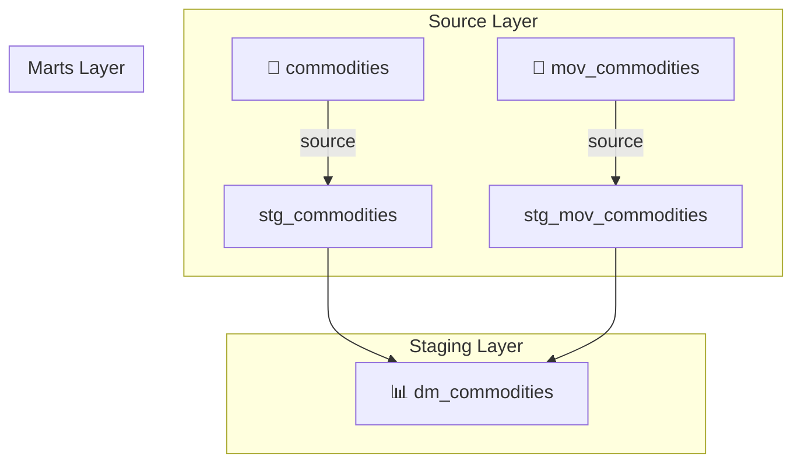



# 📊 Projeto dbt — PipelineCommodities

## 🧭 Visão Geral

O projeto **PipelineCommodities** tem como objetivo centralizar, transformar e documentar dados relacionados a **commodities** e suas **movimentações de compra e venda**, garantindo consistência e rastreabilidade ao longo do pipeline de dados.

As principais fontes de dados estão no schema `public`, e são tratadas e integradas em camadas de *staging* e *marts* para posterior análise e modelagem de indicadores financeiros.

---

## 🏗️ Estrutura do Projeto

```
├── models/
│   ├── staging/
│   │   ├── stg_commodities.sql
│   │   ├── stg_mov_commodities.sql
│   │   └── schema.yml
│   ├── marts/
│   │   ├── dm_commodities.sql
│   │   └── schema.yml
│   └── homepage.md  ← (este arquivo)
└── seeds/
```

---

## 🗂️ Fontes de Dados (`sources`)

### 🔹 Fonte: `PipelineCommodities`

Local: `schema: public`

| Tabela              | Descrição                                                |
| ------------------- | -------------------------------------------------------- |
| **commodities**     | Contém dados históricos de preços de commodities.        |
| **mov_commodities** | Registra movimentações de compra e venda de commodities. |

#### 📋 Estrutura das Tabelas

**commodities**

| Coluna    | Descrição                           |
| --------- | ----------------------------------- |
| `Date`    | Data da observação.                 |
| `Close`   | Preço de fechamento da commodity.   |
| `simbolo` | Símbolo que identifica a commodity. |

**mov_commodities**

| Coluna     | Descrição                     |
| ---------- | ----------------------------- |
| `date`     | Data da transação.            |
| `symbol`   | Símbolo da commodity.         |
| `action`   | Tipo de transação (buy/sell). |
| `quantity` | Quantidade transacionada.     |

---

## 🧱 Camada de *Staging*

### `stg_commodities`

* Faz a limpeza e padronização dos dados históricos de commodities.
* Garante consistência nos tipos de dados (`data`, `simbolo`, `valor_fechamento`).
* Serve como base para os modelos analíticos.

### `stg_mov_commodities`

* Trata as informações de movimentações (compra/venda).
* Uniformiza nomes de colunas (`acao`, `quantidade`, etc.).
* Prepara os dados para integração com a base de preços.

---

## 📈 Camada de *Marts* — `dm_commodities`

Modelo principal: `dm_commodities.sql`

**Descrição:**
Integra as informações de preços e movimentações de commodities para gerar uma visão consolidada por data e símbolo.

**Lógica Principal:**

1. Junta `stg_commodities` e `stg_mov_commodities` pelas colunas `data` e `simbolo`.
2. Calcula o valor total e o ganho/perda de cada transação:

   ```sql
   case
       when acao = 'sell' then quantidade * valor_fechamento
       else -(quantidade * valor_fechamento)
   end as ganho
   ```
3. Filtra apenas o último dia disponível (`max(data)`).

**Campos de saída:**

| Coluna             | Descrição                                                   |
| ------------------ | ----------------------------------------------------------- |
| `data`             | Data da transação.                                          |
| `simbolo`          | Identificador da commodity.                                 |
| `valor_fechamento` | Preço no fechamento.                                        |
| `acao`             | Tipo da operação.                                           |
| `quantidade`       | Quantidade negociada.                                       |
| `valor`            | Valor total da transação (`quantidade * valor_fechamento`). |
| `ganho`            | Ganho ou perda da operação.                                 |

---

## 🗺️ Diagrama de Fluxo (Mermaid)



---

## ⚙️ Execução e Documentação

Para rodar o pipeline completo:

```bash
dbt run
```

Para executar apenas os modelos principais:

```bash
dbt run -m stg_commodities stg_mov_commodities dm_commodities
```

Gerar e servir a documentação:

```bash
dbt docs generate
dbt docs serve
```

---

## 🧪 Testes e Qualidade de Dados

Crie testes no `schema.yml` para garantir consistência:

```yaml
columns:
  - name: simbolo
    tests:
      - not_null
      - unique
  - name: data
    tests:
      - not_null
```

Rode os testes com:

```bash
dbt test
```

---

## 📚 Próximos Passos

* Adicionar métricas agregadas (lucro total por commodity, volume negociado, variação diária).
* Implementar testes adicionais para validar *joins* e duplicidades.
* Automatizar a execução com **dbt Cloud**, **Airflow** ou **Prefect**.
* Criar dashboards conectados ao *mart* `dm_commodities`.

---

🧩 **Autor:**
Equipe de Dados — *PipelineCommodities*
📅 Atualizado em: Outubro de 2025

